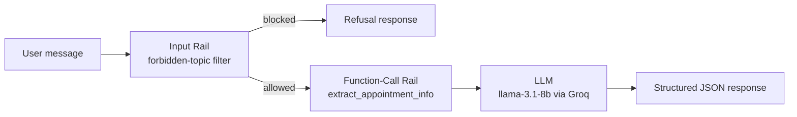

# 03-guardrails-vinmec — NeMo Guardrails for Vinmec Appointment Bot

Customised NeMo Guardrails pipeline for a Vietnamese SLM (vigpt, T5-based) deployed at Vinmec hospital system.
`llama-3.1-8b-instant` via Groq acts as a public proxy since vigpt is not publicly accessible.

## Architecture



## Sub-tasks

### 1. Function-Call Rail
Trains the model to reliably extract 12 appointment fields from noisy Vietnamese text:

| Field | Description |
|---|---|
| `customer_name` | Patient / caller name |
| `customer_phone` | Phone number |
| `medical_department` | Clinical department (e.g. tim mạch) |
| `hospital_name` | Vinmec branch |
| `appointment_date` | Date of appointment |
| `appointment_time` | Time of appointment |
| `symptoms` | Symptoms / reason for visit |
| `customer_dob` | Patient date of birth |
| `customer_place` | Province / address |
| `relationship` | Relation to patient (self, child, spouse…) |
| `cancel_num` | Number of appointments to cancel |
| `is_yes` | Explicit confirmation (true/false) |

Training data is generated in `TT_Mr_Nghi.ipynb` (Gemini API + noise injection, ~14,471 samples).

### 2. Input Rail
Colang 2.0 rule-based filter that detects and blocks questions about:
- Political parties / government critique
- Sensitive historical events (Vietnam War, land reform, …)
- Opinions about historical figures

Blocked messages receive a polite refusal in Vietnamese; all other messages pass through to the LLM.

## How to run

```bash
cd 03-guardrails-vinmec
uv venv && uv pip install -r requirements.txt

# Copy and fill in keys
cp ../.env.example ../.env
# Set GROQ_API_KEY in .env

python example.py
```

## Data generation reference
See `TT_Mr_Nghi.ipynb` for the full data pipeline:
- Source corpus: ~14,643 raw function-call pairs generated via Gemini API
- Noise injection: diacritic removal, telex-style encoding, character swaps
- Post-filter: 14,471 samples (removed 172 entries with Chinese characters)
- Output format: JSONL with `user` (noisy query) and `assistant` (`<functioncall>` JSON) columns

## Scope & Limitations
- vigpt (the production SLM) is not publicly available; `llama-3.1-8b-instant` is used as a proxy for all demo runs.
- Input rail uses keyword/phrase matching via Colang; it does not use an ML classifier — coverage depends on enumerated patterns.
- Function-call rail accuracy on out-of-distribution noise not evaluated in this demo.
- No fine-tuning is performed here; the notebook covers data generation only.
