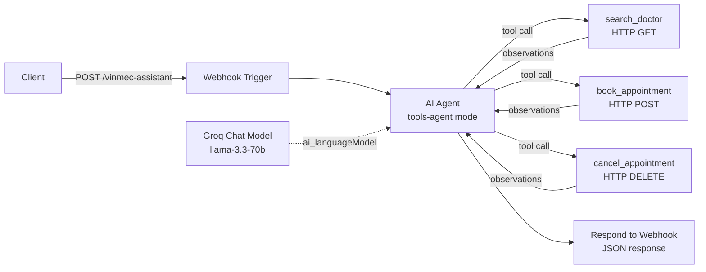

# 03 — n8n Workflow

**Framework**: n8n (self-hosted or cloud)  
**LLM backend**: Groq via n8n's built-in `lmChatGroq` node  
**Pattern**: Webhook → AI Agent node → HTTP Request tool nodes

> n8n is a **visual workflow automation** platform. Instead of writing code, you wire nodes together in a GUI. The `workflow.json` in this folder can be imported directly into any n8n instance.

## Architecture



## Import & Run

1. Open n8n (local: `npx n8n` or Docker).
2. **Workflows → Import from file** → select `workflow.json`.
3. Add a **Groq API credential** under Settings → Credentials.
4. Replace `https://api.vinmec.com/v1/...` URLs with real endpoints (or mock with n8n's HTTP mock node).
5. Activate the workflow and POST to the webhook URL shown in the Webhook node.

```bash
curl -X POST http://localhost:5678/webhook/vinmec-assistant \
  -H "Content-Type: application/json" \
  -d '{"message": "Đặt lịch khám tim mạch ngày 25/04/2026 ở Vinmec Hà Nội"}'
```

## Workflow structure

| Node | Type | Role |
|------|------|------|
| Webhook Trigger | `n8n-nodes-base.webhook` | Entry point — receives user message via HTTP POST |
| AI Agent | `@n8n/n8n-nodes-langchain.agent` | Orchestrates LLM + tool loop |
| Groq Chat Model | `@n8n/n8n-nodes-langchain.lmChatGroq` | LLM brain connected via `ai_languageModel` port |
| search_doctor | `toolHttpRequest` | HTTP GET → Vinmec doctor search API |
| book_appointment | `toolHttpRequest` | HTTP POST → Vinmec booking API |
| cancel_appointment | `toolHttpRequest` | HTTP DELETE → Vinmec cancellation API |
| Respond to Webhook | `n8n-nodes-base.respondToWebhook` | Returns JSON reply to client |

## Pros

- **No code required**: Business analysts can build and modify workflows without a developer.
- **Fast prototyping**: From idea to running agent in minutes using the visual editor.
- **Built-in integrations**: 400+ native nodes (Slack, Email, DB, CRM) — connect Vinmec to any system.
- **Error handling UI**: Retry, fallback, and alert nodes configurable visually.
- **Self-hostable**: Full data control; no vendor lock-in on data (only on tooling).

## Cons

- **Version control is painful**: Workflow JSON diffs are nearly unreadable; branching strategies are complex.
- **Vendor lock-in**: Workflow JSON is n8n-specific — cannot migrate to another orchestrator.
- **Limited code flexibility**: Complex business logic (validation, transformations) requires "Code" nodes, defeating the no-code promise.
- **Debugging is harder at scale**: Tracing multi-hop failures in large workflows is tedious vs. stack traces.
- **Not developer-first**: No type safety, no unit tests, no IDE support for logic inside nodes.

## Scope & Limitations

- `workflow.json` is a valid n8n import but uses mock Vinmec API URLs.
- Tool descriptions inside `toolHttpRequest` nodes are critical for agent accuracy — treat them like docstrings.
- n8n's AI Agent node uses LangChain under the hood; same reasoning loop as `01-langchain/`.
