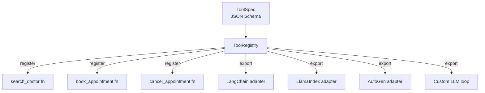

# 04 — OpenClaw (Conceptual)

**Framework**: OpenClaw (emerging standard)  
**Reference**: https://github.com/openclaw/openclaw  
**Status**: Conceptual — not production-ready as of April 2026

## What is OpenClaw?

OpenClaw proposes a **framework-agnostic tool specification standard** for LLM agents. The core problem it solves: today, tool definitions are tightly coupled to their framework (LangChain's `@tool`, LlamaIndex's `FunctionTool`, AutoGen's `register_for_execution`). Switching frameworks means rewriting all tool wiring.

OpenClaw's approach:

1. **Define tools once** using a declarative JSON Schema spec (compatible with OpenAI's function-calling format).
2. **Register implementations** independently of any framework.
3. **Export to any runtime** via thin adapters (`openclaw[langchain]`, `openclaw[llamaindex]`, etc.).

## Architecture concept



## Why it matters for Vinmec use case

Without OpenClaw: 3 tools × 4 frameworks = **12 implementations** (or copy-paste with drift).  
With OpenClaw: 3 tool implementations + 4 one-line adapter calls = **3 implementations**.

```python
# Define once
registry = ToolRegistry()

@registry.register(SEARCH_DOCTOR_SPEC)
def search_doctor(department: str, hospital: str) -> list:
    ...  # real Vinmec API call here

# Export anywhere — same business logic, different runtime
langchain_tools = registry.export_langchain()    # -> List[StructuredTool]
llamaindex_tools = registry.export_llamaindex()  # -> List[FunctionTool]
```

## Pros

- **Framework-agnostic**: Write tool logic once; run in any agent framework.
- **Future-proof**: If a better framework emerges tomorrow, swap the adapter — no tool rewrites.
- **Standards-based**: Aligns with OpenAI function-calling schema (JSON Schema Draft-07); portability across model providers.
- **Clear separation of concerns**: Tool spec (what the tool does) ≠ tool implementation (how) ≠ agent runtime (when).
- **Testability**: Tools can be unit-tested directly through `registry.call()` without spinning up an LLM.

## Cons

- **Tiny ecosystem**: Very early-stage project; minimal community, limited documentation.
- **No production deployments**: No known large-scale deployments as of April 2026.
- **Adapter coverage**: Not all frameworks have adapters yet; may need to write your own.
- **Conceptual overhead**: Adds an abstraction layer that small projects don't need.
- **No async support yet**: Current design is synchronous only.

## Comparison with other approaches

| Aspect | OpenClaw | LangChain `@tool` | LlamaIndex `FunctionTool` |
|--------|----------|-------------------|---------------------------|
| Tool portability | Full | None | None |
| Setup overhead | Medium | Low | Medium |
| Ecosystem | Tiny | Huge | Medium |
| Spec standard | OpenAI-compatible | LangChain-specific | LlamaIndex-specific |

## Scope & Limitations

- `example_concept.py` is a stub showing the intended API design; it does not run without the `openclaw` package installed.
- The ToolRegistry and ToolSpec classes in the stub are illustrative implementations, not the actual OpenClaw internals.
- Evaluated conceptually; no benchmark numbers available.
