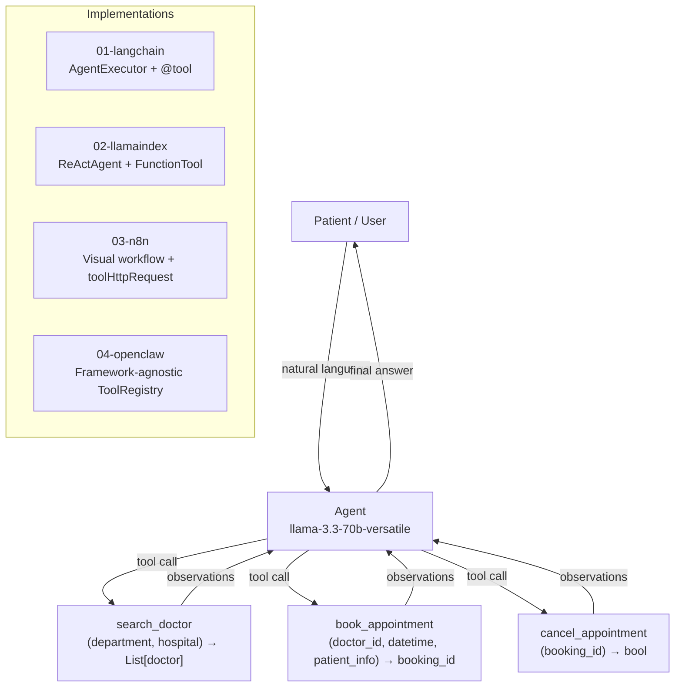

# 04 — Agent Framework Survey

**Problem**: Build a Vinmec virtual assistant that can search doctors, book appointments, and cancel bookings using natural language — then evaluate 4 different agent frameworks for this use case.

**Test query**: *"Đặt lịch khám tim mạch ngày 25/04/2026 ở Vinmec Hà Nội"*

---

## Architecture

The same 3 tools, 1 LLM, implemented across 4 frameworks:



---

## Sub-projects

| # | Framework | Pattern | Code | Notes |
|---|-----------|---------|------|-------|
| 01 | [LangChain](./01-langchain/) | `@tool` + `AgentExecutor` | `agent.py`, `example.py` | Recommended for production |
| 02 | [LlamaIndex](./02-llamaindex/) | `FunctionTool` + `ReActAgent` | `agent.py`, `example.py` | Best when RAG is also needed |
| 03 | [n8n](./03-n8n/) | Visual workflow JSON | `workflow.json` | No-code, PoC-friendly |
| 04 | [OpenClaw](./04-openclaw/) | Framework-agnostic spec | `example_concept.py` | Conceptual / future-facing |

---

## Quick start (code-based frameworks)

```bash
# LangChain
cd 01-langchain && uv venv && uv pip install -r requirements.txt
python example.py

# LlamaIndex
cd 02-llamaindex && uv venv && uv pip install -r requirements.txt
python example.py
```

Environment: create `.env` at repo root with `GROQ_API_KEY=your_key`.

---

## Summary comparison (scores 1–5)

| Dimension | LangChain | LlamaIndex | n8n | OpenClaw |
|-----------|:---------:|:----------:|:---:|:--------:|
| Setup complexity | 3 | 3 | 5 | 2 |
| Tool-calling abstraction | 5 | 4 | 3 | 4 |
| Multi-step reasoning | 5 | 4 | 3 | 3 |
| Production readiness | 5 | 4 | 4 | 1 |
| Community / ecosystem | 5 | 4 | 3 | 1 |
| Vinmec fit | 5 | 4 | 3 | 2 |
| **Total / 30** | **28** | **23** | **21** | **13** |

Full analysis: [REPORT.md](./REPORT.md)

---

## Key insights

**LangChain wins for this use case** — mature tool-calling, best observability (LangSmith), largest ecosystem for future integrations (EHR, CRM, notification services).

**LlamaIndex is the right upgrade path** if Vinmec adds a medical knowledge base ("tìm bác sĩ chuyên về...") — RAG + tool-calling in one framework.

**n8n is the fastest path to a stakeholder demo** — non-technical hospital staff can modify the booking flow without writing code.

**OpenClaw solves a real problem** (framework lock-in), but the ecosystem is too immature for production healthcare use today. Worth revisiting in 12–18 months.

---

## Reference

- [A Survey of AI Agents — arXiv 2503.21460](https://arxiv.org/pdf/2503.21460)
- LangChain docs: https://python.langchain.com
- LlamaIndex docs: https://docs.llamaindex.ai
- n8n AI Agent docs: https://docs.n8n.io/integrations/builtin/cluster-nodes/root-nodes/n8n-nodes-langchain.agent/
- OpenClaw: https://github.com/openclaw/openclaw
